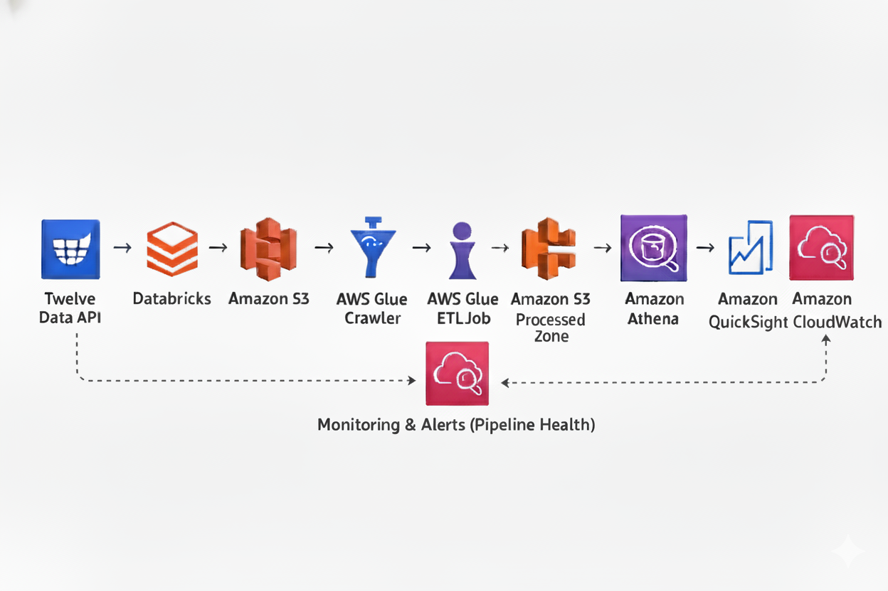

# 📊 OHLCV AWS Data Pipeline
A simple, serverless AWS pipeline that ingests, cleans, and visualizes **financial OHLCV data**.

**Stages:** Ingestion → ETL (Glue) → Query (Athena) → Visualization (QuickSight) → Monitoring (CloudWatch)

---

## Table of contents

- [Overview](#ohclv-aws-data-pipeline)
- [Repository structure](#repository-structure)
- [Quick start](#quick-start)
- [Components](#components)
- [Contributing](#contributing)

## Repository structure

Top-level folders and purpose:

- `1.ingestion/` — ingestion notebooks and scripts (data collection)
- `2.glue/` — AWS Glue job code and job definitions
- `3.athena/` — Athena queries and example SQL
- `4.quicksuite/` — QuickSight dashboards and assets
- `architecture/` — architecture diagram and notes

## Quick start

1. Open the ingestion notebook at `1.ingestion/ingestion.ipynb` to run or preview sample ingestion.
2. The Glue job implementation is in `2.glue/scripts/gluejob.py` and the job definition is `2.glue/scripts/myfirstjob.json`.
3. Run Athena queries from `3.athena/athena_queries.sql` against the prepared datasets.

Notes:
- This repo contains code and docs; AWS credentials, roles, and cloud resources are required to deploy/run the pipeline.
- For production use, create dedicated IAM roles, S3 buckets, and Glue/Athena configurations.

## Components

- Ingestion: Python notebooks to fetch and prepare raw OHLCV data.
- ETL: AWS Glue jobs to clean and transform data into a queryable format.
- Query: Athena for serverless SQL queries over the transformed data.
- Visualization: QuickSight dashboards for charts and insights.
- Monitoring: CloudWatch for logs and alarms.

## Contributing

Contributions welcome. Please open issues or pull requests for improvements, bug fixes, or documentation updates.

---

If you'd like, I can also add a `.gitignore` tuned for Python and Jupyter notebooks and a short CONTRIBUTING.md.
