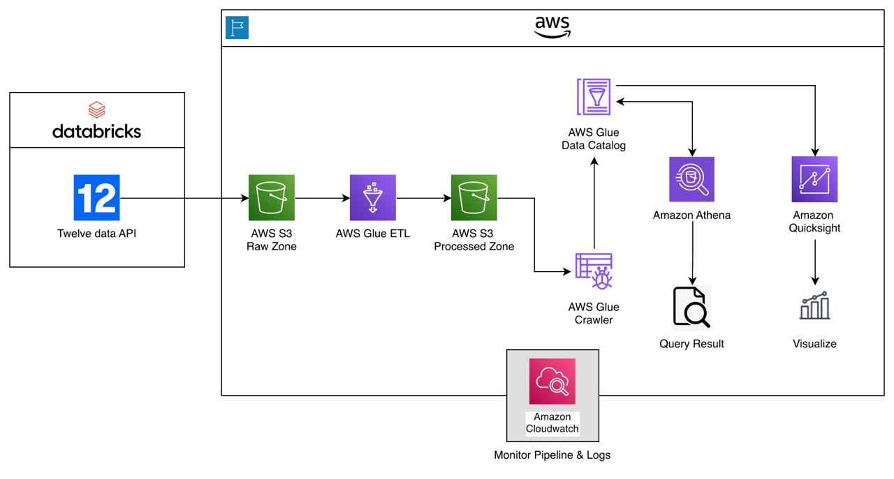

# AWS Dataflow — Serverless ETL & Analytics Pipeline

This repository demonstrates a fully automated, serverless ETL and analytics pipeline built on AWS. The pipeline ingests OHLCV financial time-series data from external APIs, processes and validates the data with AWS Glue, catalogs it, and provides analytics via Amazon Athena and QuickSight — all while maintaining monitoring and observability with CloudWatch.

**Table of contents**
- **Architecture:** Overview and diagram
- **Data Ingestion:** Databricks notebook + Twelve Data API
- **AWS Glue:** ETL jobs, data quality, and Glue Catalog
- **Athena:** SQL queries and sample insights (`3.athena/athena_queries.sql`)
- **QuickSight:** Example visualizations
- **Monitoring:** CloudWatch logs, metrics, dashboards
- **Files of interest:** `1.ingestion/ingestion.ipynb`, `2.glue/scripts/gluejob.py`, `3.athena/athena_queries.sql`

## Repository structure

Top-level folders and purpose:

- `1.ingestion/` — ingestion notebooks and scripts (data collection)
- `2.glue/` — AWS Glue job code and job definitions
- `3.athena/` — Athena queries and example SQL
- `4.quicksight/` — QuickSight dashboards and assets
- `architecture/` — architecture diagram and notes

## Quick start

1. Open the ingestion notebook at `1.ingestion/ingestion.ipynb` to run or preview sample ingestion.
2. The Glue job implementation is in `2.glue/scripts/gluejob.py`.
3. Run Athena queries from `3.athena/athena_queries.sql` against the prepared datasets.

Notes:
- This repo contains code and docs; AWS credentials, roles, and cloud resources are required to deploy/run the pipeline.
- For production use, create dedicated IAM roles, S3 buckets, and Glue/Athena configurations.

## Components

- Ingestion: Python notebooks to fetch and prepare raw OHLCV data.
- ETL: AWS Glue jobs to clean and transform data into a queryable format.
- Query: Athena for serverless SQL queries over the transformed data.
- Visualization: QuickSight dashboards for charts and insights.
- Monitoring: CloudWatch for logs and alarms.
