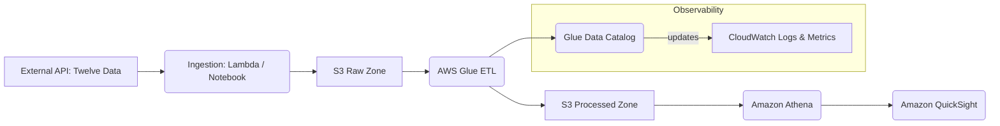

---
# AWS Serverless OHLCV Data Engine

[](https://www.python.org/)
[](https://aws.amazon.com/glue/)
[](https://aws.amazon.com/athena/)

Overview
--------
This repository implements a production-ready, serverless data engine that ingests OHLCV time-series, performs ETL and data quality operations, catalogs data for querying, and exposes analytics to business users via QuickSight.

System Architecture
-------------------
Mermaid (logical) diagram:



Rendered architecture (PNG):


Visual assets
-------------
- QuickSight dashboards: `docs/assets/dashboards/` (1.png, 2.png, 4.png, 6.png)
- Glue-specific diagrams: `docs/assets/glue/` (gluejob.png, jobruns.png, monitoring_glue.png)
- Monitoring screenshots: `docs/assets/monitoring/` (data_quality_checks.png, image.png, image copy.png)

Project layout
--------------
```text
aws-dataflow/
├─ notebooks/                # exploratory notebooks and ingestion PoCs
├─ src/
│  └─ etl/
│     └─ jobs/               # Glue job scripts (production-ready)
├─ sql/
│  └─ queries/               # Athena queries
├─ docs/
│  └─ assets/                # diagrams, dashboards, monitoring screenshots
├─ requirements.txt
└─ README.md
```

Component deep dive
-------------------

- Ingestion
  - Source: Twelve Data (OHLCV). Implemented as notebooks for development and Lambda or scheduled job for production.
  - Responsibilities: auth, retries, throttling, payload normalization, and partitioned writes to S3 raw zone.

- ETL (AWS Glue)
  - Schema enforcement and timestamp standardization (UTC ISO-8601).
  - Deduplication strategy (instrument_id, timestamp, trade_id) using deterministic windows.
  - Type casting, null handling and data-quality checks (Glue Data Quality, custom rules).
  - Derived metrics: daily_return, pct_change, vwap; rollups: hourly/daily OHLC and volume aggregates.
  - Output format: Parquet partitioned by date and symbol for efficient Athena reads.

- Cataloging & Querying
  - Glue Data Catalog kept in sync via Crawler or API updates.
  - Athena queries under `sql/queries/` follow CTAS and partition-pruning best practices.

- Visualization & Consumers
  - QuickSight datasets connect to Athena. Dashboard exports are stored under `docs/assets/dashboards/` for documentation.

- Observability
  - CloudWatch collects Glue logs, custom metrics, and alarms. Monitoring screenshots live in `docs/assets/monitoring/`.

Prerequisites & AWS permissions
-------------------------------
Example IAM permissions (scope least-privilege where possible):

- S3: `s3:GetObject`, `s3:PutObject`, `s3:ListBucket`, `s3:DeleteObject`
- Glue: `glue:CreateJob`, `glue:StartJobRun`, `glue:GetJobRun`, `glue:CreateCrawler`, `glue:GetTable`, `glue:UpdateTable`
- Athena: `athena:StartQueryExecution`, `athena:GetQueryExecution`, `athena:GetQueryResults`
- CloudWatch: `logs:CreateLogGroup`, `logs:CreateLogStream`, `logs:PutLogEvents`, `cloudwatch:PutMetricAlarm`

Developer workflow
------------------

1. Configure environment: set S3 bucket names and Glue database in environment variables or a parameter store.
2. Validate transformations locally with unit tests and small Spark runs.
3. Deploy Glue job (via console, CLI, or IaC):

```bash
aws glue start-job-run --job-name my-glue-job --arguments '--S3_INPUT=s3://mybucket/raw/ --S3_OUTPUT=s3://mybucket/processed/'
```

4. Monitor job state in CloudWatch and validate output in S3 and Athena.

Maintenance & contributions
---------------------------
- Keep visual assets organized under `docs/assets/` by purpose (dashboards, glue, monitoring).
- Add unit tests for Glue transforms under `tests/` and update `requirements.txt` for dev dependencies.

Contact / next steps
--------------------
If you want, I can:
- convert the canonical architecture PNG to SVG and replace `docs/assets/diagrams/image.png` for crisper docs;
- generate a `docs/assets/README.md` that documents naming conventions and where to add new images;
- scaffold unit tests for the Glue job transformations.

---
# AWS Dataflow — Serverless ETL & Analytics Pipeline

# AWS Serverless OHLCV Data Engine

[](https://www.python.org/)
[](https://aws.amazon.com/glue/)
[](https://aws.amazon.com/athena/)

Overview
--------
This repository implements an enterprise-grade, serverless data engine for OHLCV financial time-series. The engine is designed for production workloads: clear separation of ingestion, ETL, cataloging, analytics, visualization, and monitoring responsibilities.

System Architecture (Mermaid)
--------------------------------


Note: visual assets exist under `docs/assets/diagrams` and `docs/assets/dashboards` for reference and reporting screenshots.

Architecture (Rendered)
----------------------

The canonical architecture diagram is embedded below (PNG). If your renderer supports Mermaid, the textual diagram above will also render.


QuickSight Dashboard Examples
-----------------------------

Small thumbnails exported from QuickSight for documentation:


Project structure (cleaned)
---------------------------
```text
aws-dataflow/
├─ notebooks/
│  └─ exploration/           # interactive notebooks and ingestion proof-of-concept
├─ src/
│  └─ etl/
+     └─ jobs/               # Glue job scripts (python files)
├─ sql/
│  └─ queries/               # Athena SQL queries
├─ docs/
│  └─ assets/
│     ├─ dashboards/         # QuickSight exports and screenshots
│     ├─ diagrams/           # Architecture diagrams (png/svg)
│     └─ monitoring/         # CloudWatch dashboard images and logs
├─ (scripts removed)         # utility scripts directory removed per repo hygiene
├─ requirements.txt
└─ README.md
```

Pipeline Components — Technical Deep Dive
----------------------------------------

- Ingestion (Lambda / Notebook)
	- Retrieves OHLCV timeseries from the Twelve Data API with resilient retries and exponential backoff.
	- Normalizes incoming payloads to a canonical JSON schema.
	- Partitions raw files into `s3://<bucket>/raw/source=twelvedata/date=YYYY-MM-DD/`.

- Glue ETL (Python/Glue Spark)
	- Standardizes timestamp formats to UTC ISO-8601 and enforces a schema (timestamp, symbol, open, high, low, close, volume).
	- Deduplication: dedupes records by (instrument_id, timestamp, trade_id) using deterministic sort+drop_duplicates window.
	- Data typing & casting: enforces numeric types, null-safe conversions, and currency/scale normalization.
	- Enrichments: adds derived fields (daily_return, pct_change, vwap) and maps instrument metadata.
	- Aggregations: produces hourly/daily aggregates for volume and OHLC rollups.
	- Outputs: writes Parquet partitioned by `date` and `symbol` into `s3://<bucket>/processed/`.

- Glue Data Catalog
	- Glue Crawler or Glue API updates table schemas after ETL runs to ensure compatible Athena queries.

- Athena (Ad-hoc + Scheduled)
	- Executes analytics queries on Parquet data; best practices include partition pruning and CTAS patterns for heavy queries.
	- Example queries live under `sql/queries/` (returns, volatility windows, top movers).

- QuickSight
	- Uses Athena datasets; dashboards export PNGs/SVGs to `docs/assets/dashboards/` for documentation.

- Observability (CloudWatch)
	- ETL job durations, failure rates, S3 ingestion metrics, and custom Glue job logs are captured in CloudWatch.
	- Alarms notify on job failures and ingestion anomalies (high API latency, large error rates).

Prerequisites & Permissions
---------------------------

Minimum AWS IAM permissions (example roles/policy scope):

- S3: `s3:GetObject`, `s3:PutObject`, `s3:ListBucket`, `s3:DeleteObject` for raw and processed buckets
- Glue: `glue:CreateJob`, `glue:StartJobRun`, `glue:GetJobRun`, `glue:CreateCrawler`, `glue:GetTable`, `glue:UpdateTable`
- Athena: `athena:StartQueryExecution`, `athena:GetQueryExecution`, `athena:GetQueryResults`
- CloudWatch: `logs:CreateLogGroup`, `logs:CreateLogStream`, `logs:PutLogEvents`, `cloudwatch:PutMetricAlarm`
- IAM: ability to assume roles required by Glue and Lambda (limited to administrators/infra team)

How to run the Glue job locally (developer flow)
---------------------------------------------

1. Edit configuration placeholders (S3 bucket names, Glue database) in `src/etl/jobs/` or environment variables.
2. Use the provided Glue local runner or test harness (if available) to validate transformations. Example (unit test approach):

```bash
# run local unit tests / small Spark run (example)
pytest tests/ -q
```

3. To execute the Glue job in AWS (console or CLI):

```bash
# submit a Glue job run (example)
aws glue start-job-run --job-name my-glue-job --arguments '--S3_INPUT=s3://mybucket/raw/ --S3_OUTPUT=s3://mybucket/processed/'
```

4. Verify Glue job status and logs in CloudWatch and check the output partitions in S3.

Notes & Next actions
--------------------
- The repo contains visual assets in `docs/assets/diagrams` and `docs/assets/dashboards`. For public documentation, prefer SVG exports for crispness.
- I added `scripts/restructure.sh` — run it locally to perform the reorganization. Review staged changes before committing.

If you want, I can:
- run the restructure for you and commit the changes, or
- convert `architecture/image.png` to a high-resolution SVG and reference it in `docs/`.
