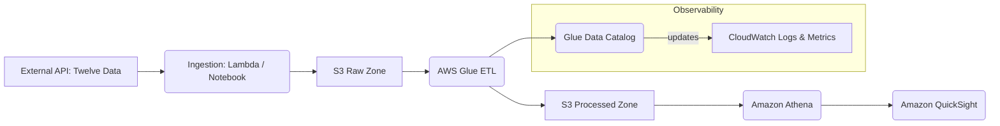

---
# AWS Serverless OHLCV Data Engine

[](https://www.python.org/)
[](https://aws.amazon.com/glue/)
[](https://aws.amazon.com/athena/)

Overview
--------
This repository implements a production-ready, serverless data engine that ingests OHLCV time-series, performs ETL and data quality operations, catalogs data for querying, and exposes analytics to business users via QuickSight.

System Architecture
-------------------



Rendered architecture (PNG):


Visual assets
-------------
- QuickSight dashboards: `docs/assets/dashboards/` (1.png, 2.png, 4.png, 6.png)
- Glue-specific diagrams: `docs/assets/glue/` (gluejob.png, jobruns.png, monitoring_glue.png)
- Monitoring screenshots: `docs/assets/monitoring/` (data_quality_checks.png, image.png, image copy.png)

Project layout
--------------
```text
aws-dataflow/
├─ notebooks/                # exploratory notebooks and ingestion PoCs
├─ src/
│  └─ etl/
│     └─ jobs/               # Glue job scripts (production-ready)
├─ sql/
│  └─ queries/               # Athena queries
# AWS Serverless OHLCV Data Engine

[](https://www.python.org/)
[](https://aws.amazon.com/glue/)
[](https://aws.amazon.com/athena/)

Overview
--------
This repository implements a production-ready, serverless data engine that ingests OHLCV time-series, performs ETL and data-quality operations, catalogs data for querying, and exposes analytics to business users via QuickSight.

System Architecture
-------------------


Architecture (PNG)
------------------


Visual assets
-------------
- QuickSight dashboards: `docs/assets/dashboards/` (`1.png`, `2.png`, `4.png`, `6.png`)
- Glue diagrams: `docs/assets/glue/` (`gluejob.png`, `jobruns.png`, `monitoring_glue.png`)
- Monitoring screenshots: `docs/assets/monitoring/` (`data_quality_checks.png`, `image.png`)

Project layout
--------------
```text
aws-dataflow/
├─ notebooks/                # exploratory notebooks and ingestion PoCs
├─ src/                      # production code
│  └─ etl/
│     └─ jobs/               # Glue job scripts
├─ sql/
│  └─ queries/               # Athena queries
├─ docs/
│  └─ assets/                # diagrams, dashboards, monitoring screenshots
├─ requirements.txt
└─ README.md
```

QuickSight Dashboard Examples
-----------------------------


How to run (quick)
------------------

1. Set S3 bucket names and Glue database in environment variables or a parameter store.
2. Run unit tests for transforms (if available): `pytest tests/`.
3. Start Glue job (example):

```bash
aws glue start-job-run --job-name my-glue-job --arguments '--S3_INPUT=s3://mybucket/raw/ --S3_OUTPUT=s3://mybucket/processed/'
```

Contact / next steps
--------------------
- I can convert `docs/assets/diagrams/image.png` to `image.svg` for crisper diagrams.
- I can also sweep the `docs/` folder to ensure all READMEs render correctly and then push the cleanup commit.
